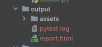

# desktop-app-test

This is the test automation project based on Selenium-Webdriver with Python on pytest framework. The test module contains single e2e case to verify the download links for MEGA Desktop App are working for all linux distributions.

# Project Structure

Here you can find a short description of main directories and it's content

* **data** - Inside this folder there are 2 files to store the static data. locator.py to store page element locator, config.py to store other constant data.

* **resources** - Inside this folder there is "helper.py" file to store the helper functions.
* **test** - There is single test file inside this folder contains the actual test methods.
* **output** - This folder will generate runtime to store execution logs & default pytest html report.

# Project Features

* It follows pytest framework
* To Access web ui component, selenium webdriver is used
* Test can run on headless mode in firefox browser, which is define in conftest.py, e.g.

`@fixture(scope='session')
def start_driver():
    logging.info("starting firefox headless driver")
    options = Options()
    options.headless = True
    driver = webdriver.Firefox(options=options, executable_path='geckodriver.exe')
    yield driver
    driver.quit()`
* geckodriver.exe file is available inside the project, just ensure it's compatible with local browser version.

* logger has been implemented & it's configuration store in pytest.ini file & log file can be accessible in output/pytest.log

# Getting Started

To run the test, just download the project or clone repository. You need to install packages using pip according to requirements.txt file. Run the command below in terminal:

`$ pip install -r requirements.txt`

# Run Tests

The test uses pytest framework, to run the test from cmd use below command

`$ pytest`

# Generate Report

below command can be used to generate pytest default html report, which will be stored as below structure

`$ pytest --html=output/report.html`

